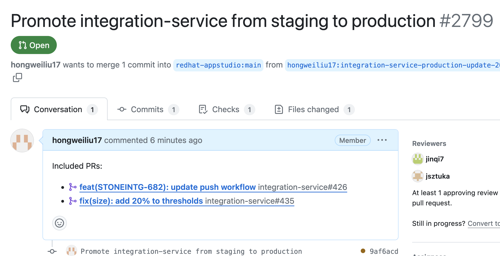
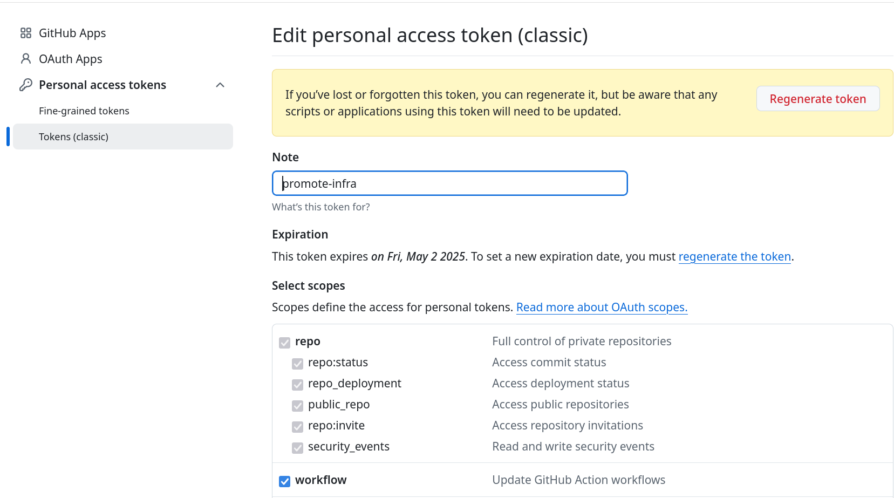

# Promotion of Integration Service overlays in the infra-deployments repo

## Introduction

The Integration Service in KONFLUX is deployed to environments using ArgoCD. The specific content to be deployed to each environment is controlled by overlays.

There are 3 overlays:
- development
- staging
- production

Currently, when a PR is merged in the integration-service repo, a PR in the infra-deployments repo is created by a KONFLUX release pipeline which updates the **development** and **staging** overlay.

Promotion from a lower environment to higher environment is done manually by updating the target overlay.

This script helps to automate this promotion. It analyzes the commits between the source and the target overlays and creates an infra-deployments PR updating the overlay file and includes a changelog.



## Setup

* The script requires an environment variable called _**GITHUB_TOKEN**_ to exist. This token should have the workflow scope(to be in sync with upstream repo) which by default enables repo scope:



* The script also has 3 required arguments
  * **source-overlay**: Name of the source overlay to promote to target
  * **target-overlay**: Name of the overlay to target for promotion
  * **fork-owner**: Name of the owner of your infra-deployments fork in Github

## Running the script

```
% ./ci/promote-overlay/promote-overlay.sh --source-overlay staging --target-overlay production --fork-owner hongweiliu17
```

## Example output
```
---
Promoting integration-service staging to production in redhat-appstudio/infra-deployments
---

Sync fork with upstream:
{ "message": "This branch is not behind the upstream redhat-appstudio:main.", "merge_type": "none", "base_branch": "redhat-appstudio:main" }
Cloning into 'infra-deployments'...
remote: Enumerating objects: 22444, done.
remote: Counting objects: 100% (39/39), done.
remote: Compressing objects: 100% (31/31), done.
remote: Total 22444 (delta 9), reused 28 (delta 6), pack-reused 22405
Receiving objects: 100% (22444/22444), 3.72 MiB | 577.00 KiB/s, done.
Resolving deltas: 100% (14569/14569), done.
Cloning into 'integration-service'...
remote: Enumerating objects: 4866, done.
remote: Counting objects: 100% (1086/1086), done.
remote: Compressing objects: 100% (307/307), done.
remote: Total 4866 (delta 858), reused 905 (delta 779), pack-reused 3780
Receiving objects: 100% (4866/4866), 31.42 MiB | 259.00 KiB/s, done.
Resolving deltas: 100% (3487/3487), done.
HEAD is now at 720f747e Revert "Simplify backup ApplicationSet generators (#2793)" (#2797)
branch 'integration-service-production-update-2023_11_22__16_36_25' set up to track 'origin/main'.
Switched to a new branch 'integration-service-production-update-2023_11_22__16_36_25'

integration-service source overlay commit -> 169329939d92d6345e2eaa6882527dea6b027c54
integration-service target overlay commit -> 1c09614c43e1e50c768b5ddce35e344290e420ff

Run standard RH pre-commit checks........................................Passed
[integration-service-production-update-2023_11_22__16_36_25 9af6acd9] Promote integration-service from staging to production
 1 file changed, 2 insertions(+), 2 deletions(-)
Enumerating objects: 7, done.
Counting objects: 100% (7/7), done.
Delta compression using up to 12 threads
Compressing objects: 100% (4/4), done.
Writing objects: 100% (4/4), 407 bytes | 407.00 KiB/s, done.
Total 4 (delta 3), reused 0 (delta 0), pack-reused 0
remote: Resolving deltas: 100% (3/3), completed with 3 local objects.
remote: 
remote: Create a pull request for 'integration-service-production-update-2023_11_22__16_36_25' on GitHub by visiting:
remote:      https://github.com/hongweiliu17/infra-deployments/pull/new/integration-service-production-update-2023_11_22__16_36_25
remote: 
To github.com:hongweiliu17/infra-deployments.git
 * [new branch]        integration-service-production-update-2023_11_22__16_36_25 -> integration-service-production-update-2023_11_22__16_36_25

==================================
Pull request created successfully:
- https://github.com/redhat-appstudio/infra-deployments/pull/2799
==================================
```